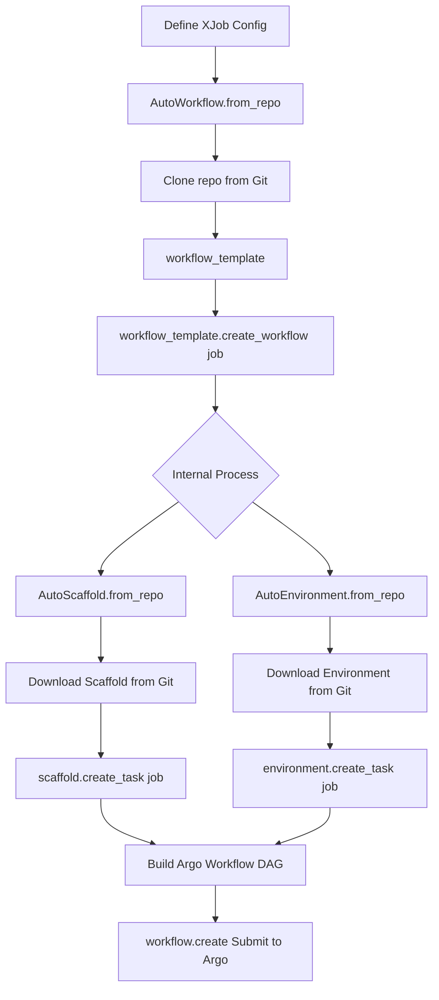

# XJob User Guide

## Overview

XJob is the core configuration protocol of the Interaxions framework, used to define and pass all configurations and parameters required to build Argo Workflows. Through XJob, users can describe a complete task execution flow in a declarative manner, and then have AutoWorkflow **dynamically load from remote Git repositories** the workflow implementation, combined with specified scaffold (Agent) and environment, to build a complete Argo Workflow.

**Core Advantages**:
- 🚀 **Remote Dynamic Loading**: Load components directly from GitHub, GitLab, and other Git repositories, no local installation required
- 🔄 **Version Control**: Support Git tags/branches/commits for precise component version control
- 🔌 **Plug and Play**: Just provide the repository address, automatic download, caching, and loading
- 🌐 **Team Collaboration**: Components can be shared and reused across teams with unified management

## Core Concepts

### What is XJob?

XJob is a serializable configuration object that encapsulates all the information needed to run AI Agents on Kubernetes/Argo Workflows:

- **Model**: LLM configuration (which model to use, API keys, etc.)
- **Scaffold**: Agent implementation (how to execute tasks)
- **Environment**: Environment configuration (where to execute, what to verify)
- **Workflow**: Orchestration logic (how to organize Agent and Environment)
- **Runtime**: K8s/Argo runtime configuration (namespace, resource limits, etc.)

### Design Philosophy

```
XJob defines WHAT (what to run)
Workflow defines HOW (how to run)
```

- **Remote First**: Components are loaded dynamically from remote repositories like GitHub/GitLab by default
- **Composability**: XJob components can be flexibly composed and configured as needed
- **Serializability**: Can be saved as JSON for easy storage, transmission, and version control
- **Reproducibility**: The same XJob configuration produces the same execution results
- **Version Controllable**: Precisely control component versions through Git tags/branches/commits

## Git Repository Configuration (Required for Remote Loading)

### Supported Git Services

Interaxions supports loading components from various Git services:

- **GitHub** (recommended): `github.com` - Most widely used, excellent for open-source projects
- **GitLab**: `gitlab.com` or self-hosted instances
- **Gitea** or other Git services: configured via `IX_ENDPOINT` environment variable

### Repository Address Format

```python
# Standard format: organization/repository
repo_name_or_path="your-org/ix-swe-agent"

# Corresponding GitHub URL
# https://github.com/your-org/ix-swe-agent
```

### Configure Git Service Endpoint

By default, Interaxions uses GitHub. For other Git services:

```bash
# Method 1: Configure custom endpoint using environment variable
export IX_ENDPOINT="https://gitlab.com"  # or your GitLab instance

# Method 2: Configure cache directory (optional)
export IX_HOME="~/.interaxions"
export IX_HUB_CACHE="~/.interaxions/hub"
```

### Private Repository Authentication

```bash
# For GitHub: Configure Personal Access Token
export GITHUB_TOKEN="ghp_your-github-token"

# For GitLab: Configure Personal Access Token
export GITLAB_TOKEN="your-gitlab-token"
```

Then use in code:

```python
import os

job = XJob(
    scaffold=Scaffold(
        repo_name_or_path="your-org/ix-swe-agent",
        revision="v1.0.0",
        token=os.getenv("GITHUB_TOKEN"),  # Use token from environment variable
    ),
    # ... other configurations
)
```

## Workflow Process



### Detailed Steps (Remote Loading Process)

1. **Define XJob**: User creates XJob object, specifying Git repository addresses and versions
   ```python
   scaffold=Scaffold(repo_name_or_path="your-org/ix-swe-agent", revision="v1.0.0")
   ```

2. **Load Workflow**: Use `AutoWorkflow.from_repo()` to load workflow implementation from Git repository
   - First time: Clone repository from GitHub/GitLab to local cache `~/.interaxions/hub/`
   - Subsequent: Use cache directly (fast)

3. **Create Workflow**: Call `workflow_template.create_workflow(job)`

4. **Internal Orchestration** (automatically loads components from Git repositories):
   - Workflow loads scaffold implementation based on `job.scaffold.repo_name_or_path`
   - Workflow loads environment implementation based on `job.environment.repo_name_or_path`
   - Workflow calls `scaffold.create_task(job)` to create Agent task
   - Workflow calls `environment.create_task(job)` to create verification task
   - Workflow organizes tasks into a DAG (Directed Acyclic Graph)

5. **Submit Execution**: Call `workflow.create()` to submit to Argo Workflows

**Key Point**: All components (Scaffold, Environment, Workflow) are loaded remotely from Git repositories (GitHub/GitLab/etc.), no local installation required.

## XJob Configuration Structure

### Complete Example

```python
from interaxions.schemas import XJob, Scaffold, Environment, Workflow, Runtime, LiteLLMModel
from interaxions.schemas.environment import HFEEnvironmentSource

job = XJob(
    # === Metadata ===
    name="django-bugfix-experiment",
    description="Fix Django issue #12345 using SWE Agent",
    tags=["experiment", "swe-bench", "django"],
    labels={"team": "research", "priority": "high"},
    
    # === Model Configuration (Required) ===
    model=LiteLLMModel(
        provider="openai",
        model="gpt-4",
        api_key="sk-...",
        base_url="https://api.openai.com/v1",
        temperature=0.7,
        num_retries=3,
    ),
    
    # === Scaffold Configuration (Optional) ===
    scaffold=Scaffold(
        repo_name_or_path="your-org/ix-swe-agent",  # GitHub repository address
        revision="main",                             # Git version (tag/branch/commit)
        extra_params={                               # Scaffold-specific parameters
            "sweagent_config": "default.yaml",
            "max_iterations": 10,
        }
    ),
    
    # === Environment Configuration (Optional) ===
    environment=Environment(
        repo_name_or_path="your-org/ix-swe-bench",  # GitHub repository address
        environment_id="django__django-12345",       # Specific task instance ID
        source=HFEEnvironmentSource(                 # Data source configuration
            dataset="princeton-nlp/SWE-bench",
            split="test",
        ),
        extra_params={
            "predictions_path": "/workspace/predictions.json"
        }
    ),
    
    # === Workflow Configuration (Required) ===
    workflow=Workflow(
        repo_name_or_path="your-org/ix-swe-rollout-workflow",  # GitHub repository address
        revision="main",
    ),
    
    # === Runtime Configuration (Required) ===
    runtime=Runtime(
        namespace="experiments",                  # K8s namespace
        service_account="argo-workflow",
        image_pull_policy="IfNotPresent",
        ttl_seconds_after_finished=3600,
        extra_params={
            "oss_artifact_config": {              # OSS storage configuration
                "endpoint": "oss-cn-shanghai.aliyuncs.com",
                "bucket": "my-bucket",
                "key_prefix": "experiments",
                "access_key_secret": {...},
                "secret_key_secret": {...},
            }
        }
    )
)
```

### Configuration Field Descriptions

#### 1. Model Configuration

Specify LLM configuration for the Agent:

```python
model=LiteLLMModel(
    provider="openai",        # Provider: openai, anthropic, etc.
    model="gpt-4",           # Model name
    api_key="sk-...",        # API key
    base_url="https://...",  # API endpoint
    temperature=0.7,         # Sampling temperature
    num_retries=3,           # Number of retries
)
```

#### 2. Scaffold Configuration

Define Agent implementation and parameters:

```python
scaffold=Scaffold(
    repo_name_or_path="your-org/ix-swe-agent",  # GitHub/GitLab repository or local path
    revision="v1.0.0",                           # Optional: Git version
    username=None,                               # Optional: Private repo username
    token=None,                                  # Optional: Private repo token
    extra_params={                               # Scaffold-specific parameters
        "sweagent_config": "anthropic",
        "tools_parse_function": "function_call",
        "max_iterations": 100,
    }
)
```

**Supported repo_name_or_path formats:**
- **GitHub repository** (recommended): `"your-org/ix-swe-agent"` → Load dynamically from GitHub
- **GitLab repository**: `"your-org/repo-name"` → Load dynamically from GitLab
- **Local path**: `"./my-agent"` or `"/path/to/agent"` → Load from local path (for development/testing only)

#### 3. Environment Configuration

Define task environment and data sources:

```python
environment=Environment(
    repo_name_or_path="your-org/ix-swe-bench",  # GitHub repository address
    environment_id="django__django-12345",       # Task instance ID
    source=HFEEnvironmentSource(                   # HuggingFace data source
        dataset="princeton-nlp/SWE-bench",
        split="test",
    ),
    # Or use OSS data source
    # source=OSSEnvironmentSource(
    #     dataset="princeton-nlp/SWE-bench",
    #     split="test",
    #     oss_region="cn-hangzhou",
    #     oss_endpoint="oss-cn-hangzhou.aliyuncs.com",
    #     oss_access_key_id="...",
    #     oss_access_key_secret="...",
    # ),
    extra_params={
        "predictions_path": "/workspace/predictions.json"
    }
)
```

#### 4. Workflow Configuration

Specify orchestration logic implementation:

```python
workflow=Workflow(
    repo_name_or_path="your-org/ix-swe-rollout-workflow",  # GitHub repository address
    revision="v1.0.0",                                      # Optional: version
    extra_params={}                                         # Workflow-specific parameters
)
```

#### 5. Runtime Configuration

Kubernetes/Argo runtime settings:

```python
runtime=Runtime(
    namespace="experiments",              # K8s namespace
    service_account="argo-workflow",      # Service account
    image_pull_policy="IfNotPresent",     # Image pull policy
    ttl_seconds_after_finished=3600,      # Retention time after completion
    active_deadline_seconds=7200,         # Maximum execution time
    extra_params={
        "oss_artifact_config": {          # Storage configuration
            "endpoint": "...",
            "bucket": "...",
            "key_prefix": "...",
            "region": "...",
            "access_key_secret": {
                "name": "secret-name",
                "key": "key-name",
            },
            "secret_key_secret": {
                "name": "secret-name",
                "key": "key-name",
            },
        }
    }
)
```

## Example Component Repositories

Interaxions demonstrates remote dynamic loading capability through component repositories. Users only need to specify the repository address and version in XJob, and the framework will automatically download, cache, and load all components from GitHub, GitLab, or other Git services.

### 1. Scaffold Example (Agent Implementation)

**Example Repository Structure**: `your-org/ix-swe-agent`

**Usage**:
```python
scaffold=Scaffold(
    repo_name_or_path="your-org/ix-swe-agent",
    revision="v1.0.0",  # Or "main", "develop"
)
```

**Purpose**: Implements Agent execution logic, creates Agent rollout tasks

**Core Files**:
- `config.yaml`: Scaffold configuration (images, templates, etc.)
- `scaffold.py`: SWEAgent class implementation
- `templates/main.j2`: Main execution script template
- `templates/swe_rex.j2`: SWE-ReX sidecar script template

**Workflow**:
1. Receives XJob configuration
2. Extracts LLM configuration from `job.model`
3. Extracts Agent parameters from `job.scaffold.extra_params`
4. Loads environment information from `job.environment`
5. Renders Jinja2 templates to generate execution scripts
6. Creates Argo Task with main container and sidecar
7. Configures OSS artifacts (input preprocessing tools, output results)

**Key Code**:

```python
class SWEAgent(BaseScaffold):
    def create_task(self, job: XJob, **kwargs) -> Task:
        # 1. Build context from job
        context = self.build_context(
            scaffold=job.scaffold,
            model=job.model,
            environment=job.environment
        )
        
        # 2. Render execution script
        main_script = self.render_template("main", context.model_dump())
        
        # 3. Create sidecar (SWE-ReX)
        sidecars = [self.create_swerex_sidecar(job, context)]
        
        # 4. Create Container and Task
        container = Container(
            name="sweagent",
            image=self.config.image,
            command=["bash", "-c", main_script],
            inputs=[...],  # OSS artifacts
            outputs=[...], # OSS artifacts
            sidecars=sidecars,
        )
        
        return Task(name="sweagent-rollout", template=container)
```

### 2. Environment Example (Task Environment)

**Example Repository Structure**: `your-org/ix-swe-bench`

**Usage**:
```python
environment=Environment(
    repo_name_or_path="your-org/ix-swe-bench",
    revision="v1.0.0",
    environment_id="django__django-12345",
    source=HFEEnvironmentSource(dataset="...", split="test"),
)
```

**Purpose**: Implements environment verification logic, creates verification tasks

**Core Files**:
- `config.yaml`: Environment configuration
- `env.py`: SWEBenchFactory and SWEBenchEnvironment implementation
- `templates/verify.j2`: Verification script template

**Workflow**:
1. SWEBenchFactory loads specific task instances from HuggingFace or OSS
2. Creates SWEBenchEnvironment object containing task metadata
3. `create_task()` receives XJob, creates verification task
4. Configures Docker-in-Docker sidecar (for running tests)
5. Renders verification script, creates Argo Task

**Key Code**:

```python
class SWEBenchFactory(BaseEnvironmentFactory):
    def get_from_hf(self, environment_id, dataset, split, **kwargs):
        # Load dataset from HuggingFace
        dataset_obj = load_dataset(dataset, split=split)
        items = dataset_obj.filter(lambda x: x["instance_id"] == environment_id)
        item = items[0]
        
        # Create environment instance
        return SWEBenchEnvironment(
            environment_id=environment_id,
            dataset=dataset,
            split=split,
            problem_statement=item["problem_statement"],
            base_commit=item["base_commit"],
            docker_image=item["docker_image"],
            verify_template=self.config.templates["verify"],
        )

class SWEBenchEnvironment(BaseEnvironment):
    def create_task(self, job: XJob, **kwargs) -> Task:
        # Render verification script
        verify_script = Template(self.verify_template).render(
            dataset=self.dataset,
            instance_id=self.environment_id,
            predictions_path=job.environment.extra_params.get('predictions_path'),
        )
        
        # Create DinD sidecar and main container
        sidecars = [self.create_dind_sidecar(job)]
        container = Container(
            name="swe-bench",
            image=self.verify_image,
            command=["/bin/bash", "-c", verify_script],
            inputs=[...],  # Download rollout results from OSS
            outputs=[...], # Upload verification results
            sidecars=sidecars,
        )
        
        return Task(name="swe-bench-verify", template=container)
```

### 3. Workflow Example (Orchestration Logic)

**Example Repository Structure**: `your-org/ix-swe-rollout-workflow`

**Usage**:
```python
workflow=Workflow(
    repo_name_or_path="your-org/ix-swe-rollout-workflow",
    revision="v1.0.0",
)
```

**Purpose**: Orchestrates scaffold and environment, creates complete Argo Workflow DAG

**Core Files**:
- `config.yaml`: Workflow configuration
- `workflow.py`: Workflow implementation
- `templates/`: Jinja2 templates for script generation

**Workflow DAG Structure**:

```
┌─────────────────┐
│  Set Status:    │
│    Running      │
└────────┬────────┘
         │
         ▼
┌─────────────────┐
│  Agent Rollout  │  ← scaffold.create_task(job)
│   (Scaffold)    │
└────────┬────────┘
         │
         ▼
┌─────────────────┐
│  Environment    │  ← environment.create_task(job)
│  Verification   │
└────────┬────────┘
         │
         ▼
┌─────────────────┐
│  Post Process   │
└────────┬────────┘
         │
   ┌─────┴──────┐
   │            │
   ▼            ▼
┌──────┐    ┌──────┐
│Success│    │Failed│
└──────┘    └──────┘
   │            │
   ▼            ▼
Set Status   Set Status
Finished     Failed
```

**Key Code**:

```python
class SWERolloutVerifyPostProcessWorkflow(BaseWorkflow):
    def create_workflow(self, job: XJob, **kwargs) -> Workflow:
        # 1. Load scaffold
        scaffold = AutoScaffold.from_repo(
            repo_name_or_path=job.scaffold.repo_name_or_path,
            revision=job.scaffold.revision,
        )
        
        # 2. Load environment
        environment = AutoEnvironment.from_repo(
            repo_name_or_path=job.environment.repo_name_or_path,
            environment_id=job.environment.environment_id,
            source=job.environment.source,
        )
        
        # 3. Create Argo Workflow
        with Workflow(
            namespace=job.runtime.namespace,
            labels=job.labels,
            entrypoint="instance-dag",
        ) as w:
            with DAG(name="instance-dag") as dag:
                # Set status to Running
                status_running = self.create_set_status_task(job, JobStatus.Running)
                
                # Agent rollout task
                rollout_task = scaffold.create_task(job)
                
                # Environment verification task
                verify_task = environment.create_task(job)
                verify_task.dependencies = [rollout_task.name]
                
                # Post process task
                post_process_task = self.create_post_process_task(job)
                post_process_task.dependencies = [verify_task.name]
            
            # Exit handler (success/failure status update)
            with DAG(name="exit-handler") as exit_dag:
                status_finished = self.create_set_status_task(job, JobStatus.Finished)
                status_failed = self.create_set_status_task(job, JobStatus.Failed)
                
                status_finished.when = "{{workflow.status}} == Succeeded"
                status_failed.when = "{{workflow.status}} != Succeeded"
            
            return w
```

**Remote Loading Advantages**:
- 🚀 **No Installation**: Load directly from Git repositories, no need to pre-install components
- 🔄 **Auto Update**: Update repository code, users don't need manual upgrades
- 👥 **Team Collaboration**: Team members share the same component implementations and versions
- 🔒 **Permission Control**: Leverage Git service's permission management to protect sensitive implementations
- 🌐 **Open Source Friendly**: Easily share components on GitHub or use private GitLab instances

## Usage Examples

### Example 1: Complete SWE-Agent Execution Flow (Remote Loading)

```python
from interaxions.hub import AutoWorkflow
from interaxions.schemas import XJob, Scaffold, Environment, Workflow, Runtime, LiteLLMModel
from interaxions.schemas.environment import HFEEnvironmentSource

# 1. Define XJob - All components loaded remotely from Git repositories
job = XJob(
    name="fix-django-bug",
    description="Fix Django issue - Using remote Git repositories",
    
    model=LiteLLMModel(
        provider="openai",
        model="gpt-4",
        api_key="sk-...",
        base_url="https://api.openai.com/v1",
        temperature=0.7,
    ),
    
    # Load Scaffold from GitHub/GitLab remotely
    scaffold=Scaffold(
        repo_name_or_path="your-org/ix-swe-agent",
        revision="main",  # Use main branch
        extra_params={
            "sweagent_config": "anthropic",
            "max_iterations": 100,
        }
    ),
    
    # Load Environment from GitHub/GitLab remotely
    environment=Environment(
        repo_name_or_path="your-org/ix-swe-bench",
        revision="main",
        environment_id="django__django-12345",
        source=HFEEnvironmentSource(
            dataset="princeton-nlp/SWE-bench_Verified",
            split="test",
        ),
    ),
    
    # Load Workflow from GitHub/GitLab remotely
    workflow=Workflow(
        repo_name_or_path="your-org/ix-swe-rollout-workflow",
        revision="main",
    ),
    
    runtime=Runtime(
        namespace="experiments",
        service_account="argo-workflow",
        extra_params={
            "oss_artifact_config": {
                "endpoint": "oss-cn-shanghai.aliyuncs.com",
                "bucket": "my-bucket",
                "key_prefix": "swe-experiments",
                "region": "cn-shanghai",
                "access_key_secret": {
                    "name": "oss-credentials",
                    "key": "access-key",
                },
                "secret_key_secret": {
                    "name": "oss-credentials",
                    "key": "secret-key",
                },
            }
        }
    )
)

# 2. Save XJob (optional)
with open("job.json", "w") as f:
    f.write(job.model_dump_json(indent=2))

# 3. Load Workflow implementation remotely (auto download and cache)
workflow_template = AutoWorkflow.from_repo(
    repo_name_or_path=job.workflow.repo_name_or_path,
    revision=job.workflow.revision,
)
# First run: Clone repository from GitHub/GitLab
# Subsequent runs: Use cache directly (fast)

# 4. Create Argo Workflow (automatically loads scaffold and environment internally)
workflow = workflow_template.create_workflow(job)

# 5. Submit to Argo Workflows
workflow.create()

# Or export as YAML for CI/CD
yaml_content = workflow.to_yaml()
with open("workflow.yaml", "w") as f:
    f.write(yaml_content)
```

**Core Advantages Demonstrated**:
- ✅ No need to manually install any components, only Interaxions framework required
- ✅ Automatically downloads, caches, and loads all components from Git repositories
- ✅ Component updates only require modifying the `revision` field
- ✅ Team members use the same XJob configuration, ensuring consistency

### Example 2: Using Specific Component Versions (Version Control)

```python
# Production environment: Use fixed versions (Git tags) to ensure stability
job = XJob(
    name="production-swe-job",
    description="Production environment task - Using fixed versions",
    
    model=LiteLLMModel(
        provider="openai",
        model="gpt-4",
        api_key="sk-...",
        base_url="https://api.openai.com/v1",
    ),
    
    # Use specific tag version
    scaffold=Scaffold(
        repo_name_or_path="your-org/ix-swe-agent",
        revision="v2.1.0",  # Git tag
        extra_params={
            "sweagent_config": "anthropic",
            "max_iterations": 100,
        }
    ),
    
    environment=Environment(
        repo_name_or_path="your-org/ix-swe-bench",
        revision="v1.5.0",  # Git tag
        environment_id="django__django-12345",
        source=HFEEnvironmentSource(
            dataset="princeton-nlp/SWE-bench_Verified",
            split="test",
        ),
    ),
    
    workflow=Workflow(
        repo_name_or_path="your-org/ix-swe-rollout-workflow",
        revision="v3.0.0",  # Git tag
    ),
    
    runtime=Runtime(
        namespace="production",
        service_account="argo-workflow",
        ttl_seconds_after_finished=7200,
        extra_params={...}
    ),
)

# Load specified version from Git repository
workflow_template = AutoWorkflow.from_repo(
    "your-org/ix-swe-rollout-workflow",
    revision="v3.0.0",
)

workflow = workflow_template.create_workflow(job)
workflow.create()
```

**Version Control Advantages**:
- 🔒 Production environment uses fixed tags for stability
- 🔄 Development environment uses branches (like `main`) for latest updates
- 📌 Can rollback to any historical version at any time
- 🔍 Track component changes through Git commits

### Example 3: Developing and Testing New Component Versions

```python
# Scenario: Test new features in develop branch
job = XJob(
    name="test-new-features",
    description="Testing new features in develop branch",
    
    model=LiteLLMModel(
        provider="openai",
        model="gpt-4",
        api_key="sk-...",
        base_url="https://api.openai.com/v1",
    ),
    
    # Use develop branch to get latest development version
    scaffold=Scaffold(
        repo_name_or_path="your-org/ix-swe-agent",
        revision="develop",  # Development branch
        extra_params={
            "sweagent_config": "anthropic",
            "max_iterations": 100,
        }
    ),
    
    environment=Environment(
        repo_name_or_path="your-org/ix-swe-bench",
        revision="develop",  # Development branch
        environment_id="test-instance",
        source=HFEEnvironmentSource(
            dataset="princeton-nlp/SWE-bench_Verified",
            split="test",
        ),
    ),
    
    workflow=Workflow(
        repo_name_or_path="your-org/ix-swe-rollout-workflow",
        revision="develop",  # Development branch
    ),
    
    runtime=Runtime(namespace="dev"),
)

# Force reload (get latest develop branch code)
workflow_template = AutoWorkflow.from_repo(
    "your-org/ix-swe-rollout-workflow",
    revision="develop",
    force_reload=True,  # Skip cache, re-pull from Git repository
)

workflow = workflow_template.create_workflow(job)
workflow.create()
```

**Development Testing Advantages**:
- 🧪 Use `develop` or `feature/*` branches to test new features
- 🔄 `force_reload=True` gets latest code
- 🐛 Quickly verify bug fixes
- 🚀 After new features are validated, tag for production release

### Example 4: Private GitLab Repository Authentication

```python
import os

# Read Git token from environment variable
git_token = os.getenv("GITHUB_TOKEN")  # or GITLAB_TOKEN

job = XJob(
    name="private-repo-job",
    description="Using private Git repositories",
    
    model=LiteLLMModel(
        provider="openai",
        model="gpt-4",
        api_key=os.getenv("OPENAI_API_KEY"),
        base_url="https://api.openai.com/v1",
    ),
    
    # Private Scaffold repository
    scaffold=Scaffold(
        repo_name_or_path="your-org/private-agent",
        revision="v1.0.0",
        username="your-username",
        token=git_token,  # GitHub/GitLab Personal Access Token
        extra_params={
            "custom_param": "value",
        },
    ),
    
    # Private Environment repository
    environment=Environment(
        repo_name_or_path="your-org/private-env",
        revision="v1.0.0",
        environment_id="task-001",
        username="your-username",
        token=git_token,
        source=HFEEnvironmentSource(
            dataset="princeton-nlp/SWE-bench",
            split="test"
        ),
    ),
    
    # Private Workflow repository
    workflow=Workflow(
        repo_name_or_path="your-org/private-workflow",
        revision="v1.0.0",
        username="your-username",
        token=git_token,
    ),
    
    runtime=Runtime(namespace="production"),
)

# AutoWorkflow will use token to access private repositories
workflow_template = AutoWorkflow.from_repo(
    "your-org/private-workflow",
    revision="v1.0.0",
    username="your-username",
    token=git_token,
)

workflow = workflow_template.create_workflow(job)
workflow.create()
```

**Private Repository Support**:
- 🔐 Supports GitLab/GitHub Personal Access Token
- 🏢 Suitable for internal enterprise component management
- 🔒 Protects sensitive Agent implementations and configurations
- 👥 Unified permission management for team collaboration

## XJob Serialization and Persistence

XJob can be serialized to JSON for easy storage and transmission:

```python
# Save
job_json = job.model_dump_json(indent=2)
with open("job.json", "w") as f:
    f.write(job_json)

# Load
with open("job.json", "r") as f:
    loaded_job = XJob.model_validate_json(f.read())

# Validate
assert loaded_job.job_id == job.job_id
```

**Use Cases**:
- Task Queue: Put XJob in message queue, pulled by workers for execution
- Database Storage: Save task configurations and history
- API Transmission: Submit tasks via REST API
- Version Control: Commit configurations to Git for reproducibility

## Advanced Features

### 1. Dynamic Parameter Passing

XJob's `extra_params` field can pass custom parameters for flexible component configuration:

```python
job = XJob(
    scaffold=Scaffold(
        repo_name_or_path="your-org/ix-swe-agent",  # Load from GitHub/GitLab
        revision="v1.0.0",
        extra_params={
            # Scaffold-specific parameters, passed to scaffold.create_task()
            "custom_param": "value",
            "nested_config": {
                "option1": True,
                "option2": 42,
            },
            "sweagent_config": "anthropic",
            "max_iterations": 100,
        }
    ),
    runtime=Runtime(
        namespace="experiments",
        extra_params={
            # Runtime-specific parameters for Kubernetes/Argo configuration
            "custom_labels": {"env": "staging", "team": "ai"},
            "custom_annotations": {"owner": "team-a", "project": "swe-bench"},
            "oss_artifact_config": {...},  # OSS storage configuration
        }
    ),
)
```

**Parameter Passing Flow**:
- `scaffold.extra_params` → Passed to `scaffold.create_task(job)`
- `environment.extra_params` → Passed to `environment.create_task(job)`
- `runtime.extra_params` → Used for Kubernetes/Argo Workflow configuration
- `workflow.extra_params` → Passed to workflow orchestration logic

### 2. Precise Version Control (Native Git Support)

Use Git tags/branches/commits for precise component version control:

```python
# Use Git tag (recommended for production)
job = XJob(
    scaffold=Scaffold(
        repo_name_or_path="your-org/ix-swe-agent",
        revision="v1.2.3",  # Git tag - stable version
    ),
    workflow=Workflow(
        repo_name_or_path="your-org/ix-swe-rollout-workflow",
        revision="v1.2.3",
    ),
    runtime=Runtime(namespace="production"),
)

# Use Git branch (for development testing)
dev_job = XJob(
    scaffold=Scaffold(
        repo_name_or_path="your-org/ix-swe-agent",
        revision="develop",  # Git branch - development version
    ),
    workflow=Workflow(
        repo_name_or_path="your-org/ix-swe-rollout-workflow",
        revision="develop",
    ),
    runtime=Runtime(namespace="dev"),
)

# Use Git commit hash (for rolling back to specific versions)
rollback_job = XJob(
    scaffold=Scaffold(
        repo_name_or_path="your-org/ix-swe-agent",
        revision="abc123def456",  # Git commit - precise historical version
    ),
    workflow=Workflow(
        repo_name_or_path="your-org/ix-swe-rollout-workflow",
        revision="abc123def456",
    ),
    runtime=Runtime(namespace="staging"),
)
```

**Power of Version Control**:
- 🏷️ **Git tags**: Semantic versioning, clear and explicit (v1.0.0, v2.1.3)
- 🌿 **Git branches**: Track development progress (main, develop, feature/xxx)
- 🔒 **Git commits**: Precise to each commit, can rollback to any version
- 📊 **Audit Trail**: Track all changes through Git history

### 3. Multi-Data Source Support

Environment configuration is separated from data sources; Environment code is loaded from GitLab, data loaded from HuggingFace/OSS:

```python
from interaxions.schemas.environment import HFEEnvironmentSource, OSSEnvironmentSource

# HuggingFace data source (Environment implementation loaded from Git repository)
environment=Environment(
    repo_name_or_path="your-org/ix-swe-bench",  # GitHub repository (Environment implementation)
    revision="v1.0.0",
    environment_id="task-001",
    source=HFEEnvironmentSource(                 # HuggingFace data source
        dataset="princeton-nlp/SWE-bench",
        split="test",
    ),
)

# OSS data source (Environment implementation loaded from Git repository)
environment=Environment(
    repo_name_or_path="your-org/ix-swe-bench",  # GitHub repository (Environment implementation)
    revision="v1.0.0",
    environment_id="task-001",
    source=OSSEnvironmentSource(                   # OSS data source
        dataset="princeton-nlp/SWE-bench",
        split="test",
        oss_region="cn-hangzhou",
        oss_endpoint="oss-cn-hangzhou.aliyuncs.com",
        oss_access_key_id="...",
        oss_access_key_secret="...",
    ),
)
```

**Separation Advantages**:
- 🔧 **Environment code**: Loaded from Git repositories, version controllable
- 💾 **Environment data**: Loaded from HuggingFace/OSS, flexible selection
- 🌐 **Multi-cloud support**: Easily switch between different data sources
- 🔄 **Code-data decoupling**: Update code without migrating data

### 4. Intelligent Caching Mechanism

Interaxions implements a three-tier caching system to optimize remote loading performance:

1. **Repository cache**: Downloaded Git repositories cached in `~/.interaxions/hub/`
2. **Instance cache**: AutoScaffold/AutoEnvironmentFactory/AutoWorkflow cache instantiated objects
3. **Locking mechanism**: Multi-process safe file locks, supporting concurrent tasks

```python
# First load: Clone repository from GitHub/GitLab (slower)
scaffold1 = AutoScaffold.from_repo("your-org/ix-swe-agent", revision="v1.0.0")
# → Clone repository → Load configuration → Instantiate object

# Second load: Completely from cache (fast, < 100ms)
scaffold2 = AutoScaffold.from_repo("your-org/ix-swe-agent", revision="v1.0.0")
# → Directly return cached instance

# Force reload (get latest code)
scaffold3 = AutoScaffold.from_repo(
    "your-org/ix-swe-agent",
    revision="v1.0.0",
    force_reload=True  # Skip cache, re-pull from Git repository
)
```

**Cache Advantages**:
- ⚡ After first load, subsequent access speed increased by 100x
- 💾 Saves network bandwidth and Git server pressure
- 🔒 Multi-process concurrency safe, suitable for large-scale task scheduling
- 🔄 Supports forced refresh, flexible control over update timing

## Best Practices

### 1. XJob Naming Convention

```python
job = XJob(
    name="<project>-<task-type>-<identifier>",
    description="Clear task description",
    tags=["project", "category", "priority"],
    labels={
        "team": "team-name",
        "project": "project-name",
        "env": "staging|production",
    },
)
```

### 2. Version Management Strategy (Remote Repositories)

Use different version strategies based on environment:

```python
# Production environment: Use Git tags to fix versions
production_job = XJob(
    scaffold=Scaffold(
        repo_name_or_path="your-org/ix-swe-agent",
        revision="v2.1.0",  # Git tag - stable version
    ),
    environment=Environment(
        repo_name_or_path="your-org/ix-swe-bench",
        revision="v1.5.0",  # Git tag
        environment_id="task-001",
        source=HFEEnvironmentSource(dataset="...", split="test"),
    ),
    workflow=Workflow(
        repo_name_or_path="your-org/ix-swe-rollout-workflow",
        revision="v3.0.0",  # Git tag
    ),
    runtime=Runtime(namespace="production"),
)

# Development environment: Use main/develop branches to get latest code
dev_job = XJob(
    scaffold=Scaffold(
        repo_name_or_path="your-org/ix-swe-agent",
        revision="develop",  # Development branch
    ),
    environment=Environment(
        repo_name_or_path="your-org/ix-swe-bench",
        revision="develop",  # Development branch
        environment_id="task-001",
        source=HFEEnvironmentSource(dataset="...", split="test"),
    ),
    workflow=Workflow(
        repo_name_or_path="your-org/ix-swe-rollout-workflow",
        revision="develop",  # Development branch
    ),
    runtime=Runtime(namespace="dev"),
)
```

**Version Management Best Practices**:
- 🏭 **Production**: Use Git tags (like `v1.0.0`), ensure stability
- 🔧 **Testing**: Use `main` branch, validate new versions
- 🧪 **Development**: Use `develop` or `feature/*` branches, test new features
- 🚀 **Release Process**: `develop` → `main` → Tag → Update production configuration

### 3. Sensitive Information Management

Don't hardcode sensitive information in code:

```python
import os

job = XJob(
    model=LiteLLMModel(
        api_key=os.getenv("OPENAI_API_KEY"),  # Read from environment variable
        base_url=os.getenv("OPENAI_BASE_URL"),
    ),
    runtime=Runtime(
        namespace="production",
        extra_params={
            "oss_artifact_config": {
                "access_key_secret": {
                    "name": "oss-secret",      # Kubernetes Secret
                    "key": "access-key",
                },
                "secret_key_secret": {
                    "name": "oss-secret",
                    "key": "secret-key",
                },
            }
        }
    )
)
```

### 4. Error Handling

```python
try:
    workflow = workflow_template.create_workflow(job)
    result = workflow.create()
    print(f"Workflow submitted: {result.name}")
except Exception as e:
    print(f"Failed to create workflow: {e}")
    # Log, send alerts, etc.
```

### 5. Parameter Validation

Leverage Pydantic's validation capability:

```python
from pydantic import ValidationError

try:
    job = XJob(
        name="test-job",
        model=LiteLLMModel(...),
        # Missing required workflow field
    )
except ValidationError as e:
    print(f"Invalid XJob configuration: {e}")
```

## FAQ

### Q1: How to view generated Workflow YAML?

```python
workflow = workflow_template.create_workflow(job)
yaml_content = workflow.to_yaml()
print(yaml_content)
```

### Q2: How to monitor Workflow execution status?

```python
# Submit workflow
result = workflow.create()

# Use Argo CLI to view
# argo get <workflow-name> -n <namespace>
# argo logs <workflow-name> -n <namespace>
```

### Q3: How to debug remotely loaded Scaffold/Environment?

```python
# Test scaffold loaded from Git repository individually
scaffold = AutoScaffold.from_repo(
    "your-org/ix-swe-agent",
    revision="develop",  # Use development branch for debugging
    force_reload=True,   # Force reload latest code
)
task = scaffold.create_task(job)
print(task)

# Test environment loaded from Git repository individually
env = AutoEnvironment.from_repo(
    repo_name_or_path="your-org/ix-swe-bench",
    revision="develop",
    environment_id="test-001",
    source=HFEEnvironmentSource(dataset="...", split="test"),
    force_reload=True,
)
task = env.create_task(job)
print(task)

# View cache location (for debugging)
import os
cache_dir = os.path.expanduser("~/.interaxions/hub")
print(f"Cache directory: {cache_dir}")
# Can directly view cached repository code for debugging
```

### Q4: How to create custom Scaffold/Environment/Workflow?

#### Step 1: Create GitLab Repository

Create a new repository on GitLab, e.g., `your-team/custom-agent`

#### Step 2: Implement Component

Reference existing implementations, inherit base classes:

```python
# scaffold.py
from interaxions.scaffolds.base_scaffold import BaseScaffold, BaseScaffoldConfig
from pydantic import Field
from typing import Literal

class MyCustomScaffoldConfig(BaseScaffoldConfig):
    type: Literal["my-custom-scaffold"] = "my-custom-scaffold"
    image: str = Field(..., description="Docker image")
    custom_param: str = Field(default="default_value", description="Custom parameter")

class MyCustomScaffold(BaseScaffold):
    config_class = MyCustomScaffoldConfig
    config: MyCustomScaffoldConfig
    
    def create_task(self, job: XJob, **kwargs) -> Task:
        # Custom implementation
        context = {
            "model": job.model.model,
            "custom_param": self.config.custom_param,
        }
        script = self.render_template("main", context)
        
        container = Container(
            name="custom-agent",
            image=self.config.image,
            command=["bash", "-c", script],
        )
        return Task(name="custom-task", template=container)
```

#### Step 3: Create Configuration and Templates

```yaml
# config.yaml
repo_type: scaffold
image: your-registry/custom-agent:v1.0.0
custom_param: "production_value"
templates:
  main: templates/main.j2
```

```jinja2
# templates/main.j2
echo "Running custom agent..."
echo "Model: {{ model }}"
echo "Custom param: {{ custom_param }}"
# Your custom logic
```

#### Step 4: Push to Git Repository

```bash
git add .
git commit -m "Initial custom scaffold implementation"
git tag v1.0.0
git push origin main --tags
```

#### Step 5: Use in XJob

```python
job = XJob(
    scaffold=Scaffold(
        repo_name_or_path="your-org/custom-agent",  # Your GitHub/GitLab repository
        revision="v1.0.0",
        extra_params={
            "custom_param": "override_value",
        }
    ),
    # ... other configurations
)

# Interaxions will automatically load your custom implementation from Git repository
workflow_template = AutoWorkflow.from_repo(...)
workflow = workflow_template.create_workflow(job)
```

**Custom Component Advantages**:
- 📦 Components hosted on GitHub/GitLab, shared by team
- 🔄 Manage versions and changes through Git
- 🚀 Extend without modifying Interaxions framework
- 👥 Team collaborative development and maintenance
- 🌐 Easy to share open-source components on GitHub

### Q5: What's the boundary between XJob and Workflow?

- **XJob**: Declarative configuration, describes "what to do"
- **Workflow**: Implementation logic, describes "how to do it"

XJob is a generic configuration protocol; Workflow can have multiple implementations (serial, parallel, stateful, etc.), but all receive the same XJob input.

## Summary

XJob is the core configuration protocol of the Interaxions framework, implementing powerful component management capabilities through **remote dynamic loading** mechanism:

### Core Workflow

1. **Define XJob**: Describe task configuration in a declarative manner (Model, Scaffold, Environment, Workflow, Runtime)
2. **Remote Loading**: AutoWorkflow automatically downloads and loads workflow implementation from GitLab
3. **Internal Orchestration**: Workflow automatically loads scaffold and environment, creates tasks, organizes DAG
4. **Submit Execution**: Generate Argo Workflow and submit to Kubernetes cluster for execution

### Core Advantages

#### 🚀 Remote Dynamic Loading (Core Selling Point)
- Load components directly from GitHub, GitLab, and other Git services, no local installation required
- Automatic download, caching, and version management
- Support for private repositories and authentication

#### 🔄 Flexible Version Control
- Use Git tags to fix production versions
- Use branches (main/develop) to get latest code
- Rollback to any historical version at any time

#### 🔌 Plug-and-Play Component Ecosystem
- Scaffold (Agent implementation)
- Environment (Environment and verification logic)
- Workflow (Orchestration logic)
- All components can be independently developed, version managed, and reused

#### 👥 Team Collaboration Friendly
- Configuration serialized to JSON, easy to store and transmit
- Unified component management through Git, team sharing
- Version consistency ensures reproducibility

#### ⚡ High Performance Caching
- Three-tier caching system, speed increased by 100x after first load
- Multi-process concurrency safe
- Supports forced refresh

### Typical Use Cases

```python
# 1. Define XJob (configuration)
job = XJob(
    model=...,
    scaffold=Scaffold(repo_name_or_path="your-org/ix-swe-agent", revision="v1.0.0"),
    environment=Environment(repo_name_or_path="your-org/ix-swe-bench", revision="v1.0.0"),
    workflow=Workflow(repo_name_or_path="your-org/ix-swe-rollout-workflow", revision="v1.0.0"),
    runtime=...,
)

# 2. Remote load and execute (one line of code)
workflow = AutoWorkflow.from_repo(job.workflow.repo_name_or_path, revision=job.workflow.revision)
workflow.create_workflow(job).create()
```

Through XJob and remote dynamic loading mechanism, users can:
- ✅ **Focus on business logic**: Just configure, no need to worry about implementation details
- ✅ **Rapid iteration**: Component updates just push to GitLab, no redeployment needed
- ✅ **Flexible extension**: Easily create and share custom components
- ✅ **Enterprise-grade reliability**: Version control, permission management, audit trails

---

**Get Started**: Visit [Interaxions Official Documentation](https://github.com/interaxions) for more information.

